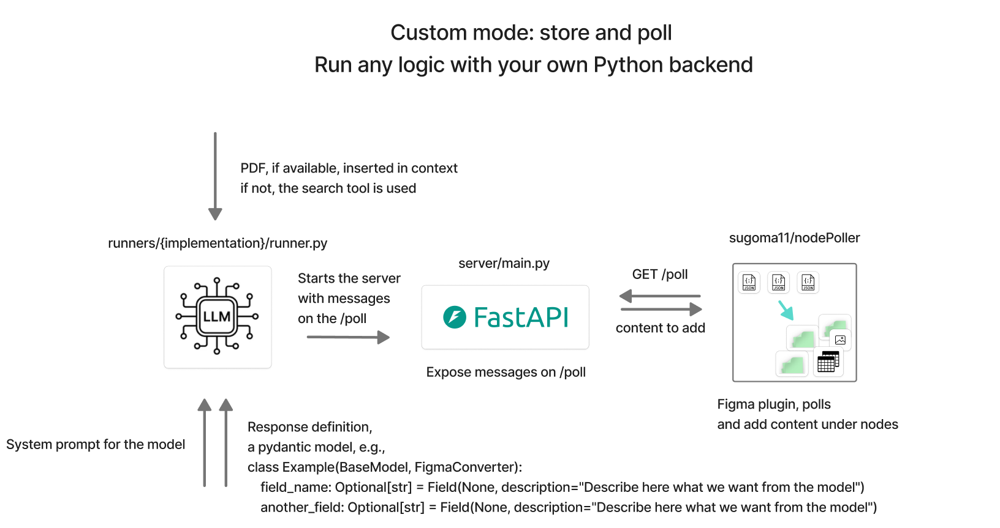
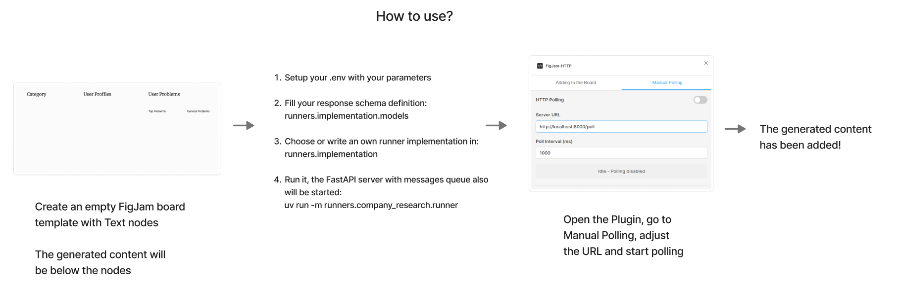
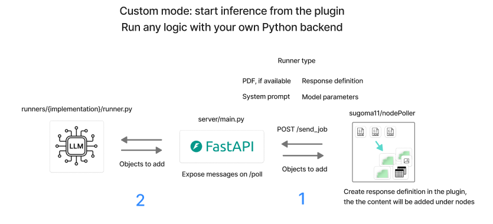
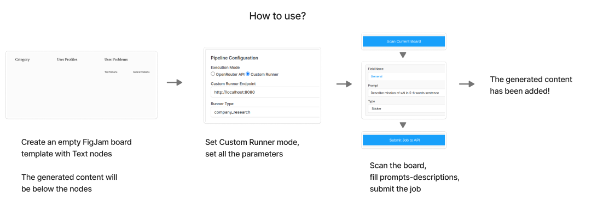

## Fill FigJam boards with LLM
**TL;DR: Generates content for FigJam boards using a provided scheme:**


### Use cases:
If you compose a lot of FigJam boards over defined templates, you can automotize it with current repo. The repo will add LLM generated content under defined Text nodes on the board.

The repo implements the following pipeline:

The pipeline:
- A user builds the FigJam board template: places sections, Text nodes. The user dumps the empty template board into the schema file, e.g., [for the company research](runners/company_research/models.py). On this stage the schema only declares fields without description
- The user fills the empty schema's description attributes which are used as a prompt
- ```uv run main.py```
- The runner creates content to add the board over a defined schema. Provide PDF or search will be used (unstable)
- The runner starts a [fastAPI server](server/main.py) containg the content
- The [Figma plugin](https://github.com/sugoma11/nodePoller) polls content from the fastAPI server and adds following content under the defined text nodes following the FigJam board structure


### Pipeline modes

### 1. Store and poll
This approach is good for development and experiments: you create something, store in the FastAPI server and get it from the ```/peek``` endpoint.






### 2. Start inference from the pluggin
This approach is good for "production".





### Install and run
1. Set your api_key, model and provider in the .env file. OpenAI API is used by default with openrouter.
2. [Install python and uv](https://docs.astral.sh/uv/guides/) and run:
```bash
uv sync
uv run main.py
```


### Supported Objects
These objects when polled are added under the exitsing text nodes:
```python

# creates a sticker
class StickerRequest(BaseModel):
    topicTitle: str
    content: str

    type: str = "addSticker"

# creates a vertical column sticker
class ColumnOfStickersRequest(BaseModel):
    topicTitle: str
    content: List[str]
    spacing: Optional[int] = 200

    type: str = "addStickerColumn"

# creates a vertical column of images
class ImagesRequest(BaseModel):
    topicTitle: str
    content: List[str] # list of b64 ims. but raw bytes will more efficient
    spacing: Optional[int] = 220

    type: str = "addImages"

# creates a table
class TableRequest(BaseModel):
    topicTitle: str
    content: List[Dict[str, str]]

    type: str = "addTable"
```

And these when polled will be created by coordinates:

```python
class SectionRequest(BaseModel):
    topicTitle: Optional[str] = None
    center: Optional[Tuple[float, float]] = None

    width: float = 1280
    height: float = 720

    type: str = 'addSection'

class TitleRequest(BaseModel):
    topicTitle: str
    location: Tuple[float, float]
    size: int
    font: str
    color: Tuple[int, int, int]

    type: str = 'addTitle'

```

### Limitations
- Right now all the PDF text is injected in the context window which can cause hallucionations. Consider more wise retrievel system.


Knowledge:

TODOs:

Features:
Add MCP attaching for the case (from UI)

CI:
Add github actions / tests (which?)