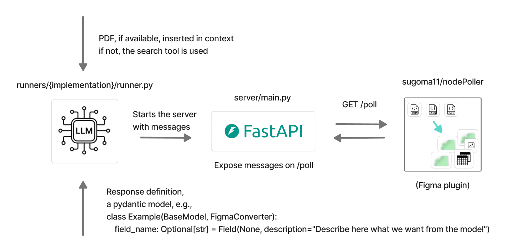
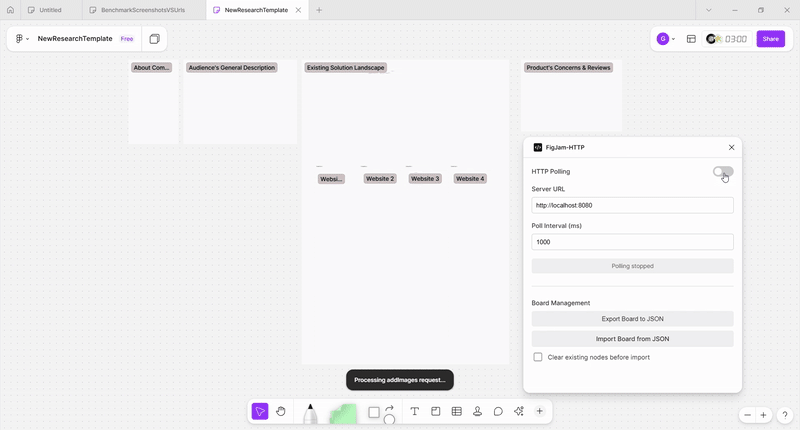

### Fill FigJam boards with LLM
**TL;DR: Generates content for FigJam boards using a provided scheme**  






The repo provides LLM-powered pipeline to fill FigJam boards using the [Figma plugin](https://github.com/sugoma11/nodePoller).  
The pipeline:
- The runner creates content to add the board over a defined schema (an [example for the company research](runners/company_research/models.py)). Provide PDF or search will be used
- The runner starts a [fastAPI server](server/main.py) containg the content
- The [Figma plugin](https://github.com/sugoma11/nodePoller) polls content from the fastAPI server and adds following the existing template


### Install and run
1. Set your api_key, model and provider in the .env file. OpenAI API is used by default with openrouter.
2. Run:
```bash
uv sync
uv run main.py
```


### Supported Objects
These objects when polled are added under the exitsing text nodes:  
```python

# creates a sticker
class StickerRequest(BaseModel):
    topicTitle: str
    content: str

    type: str = "addSticker"

# creates a vertical column sticker
class ColumnOfStickersRequest(BaseModel):
    topicTitle: str
    content: List[str]
    spacing: Optional[int] = 200

    type: str = "addStickerColumn"

# creates a vertical column of images
class ImagesRequest(BaseModel):
    topicTitle: str
    content: List[str] # list of b64 ims. but raw bytes will more efficient
    spacing: Optional[int] = 220

    type: str = "addImages"

# creates a table
class TableRequest(BaseModel):
    topicTitle: str
    content: List[Dict[str, str]]

    type: str = "addTable"
```

And these when polled will be created by coordinates:  

```python
class SectionRequest(BaseModel):
    topicTitle: Optional[str] = None
    center: Optional[Tuple[float, float]] = None
    
    width: float = 1280
    height: float = 720

    type: str = 'addSection'

class TitleRequest(BaseModel):
    topicTitle: str
    location: Tuple[float, float]
    size: int
    font: str
    color: Tuple[int, int, int]

    type: str = 'addTitle'

```

### TODO
Create a script running a conversation with an LLM getting text description of a desired board, model schemes, current pipeline description and an example of a dumped board. The script should return a new ready-to-use response schema.  
So, this repo will became a low-code tool for composing arbitary FigJam boards.